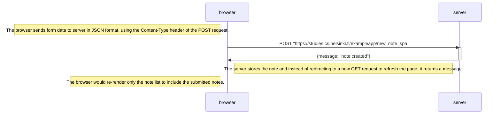

```mermaid
sequenceDiagram
participant browser
participant server
  Note left of browser: The browser sends form data to server in JSON format, using the Content-Type header of the POST request.
  browser->>server: POST "https://studies.cs.helsinki.fi/exampleapp/new_note_spa
  activate server
  server->>browser: {message: "note created"}
  deactivate server
  Note right of browser: The server stores the note and instead of redirecting to a new GET request to refresh the page, it returns a message.
  Note left of browser: The browser would re-render only the note list to include the submitted notes.


```
